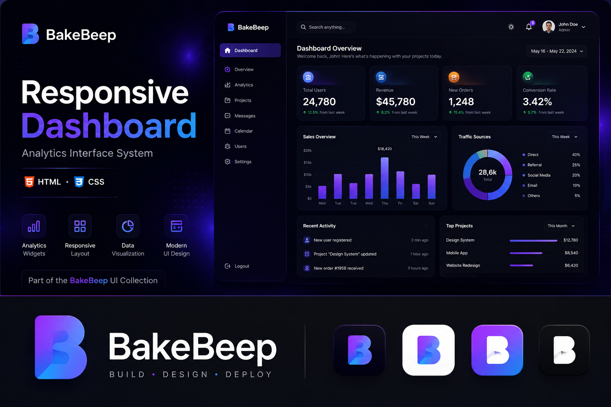
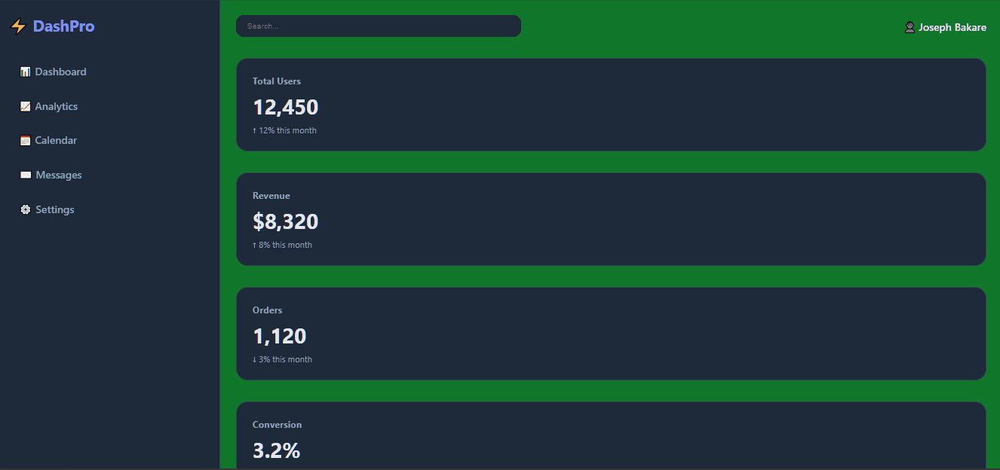
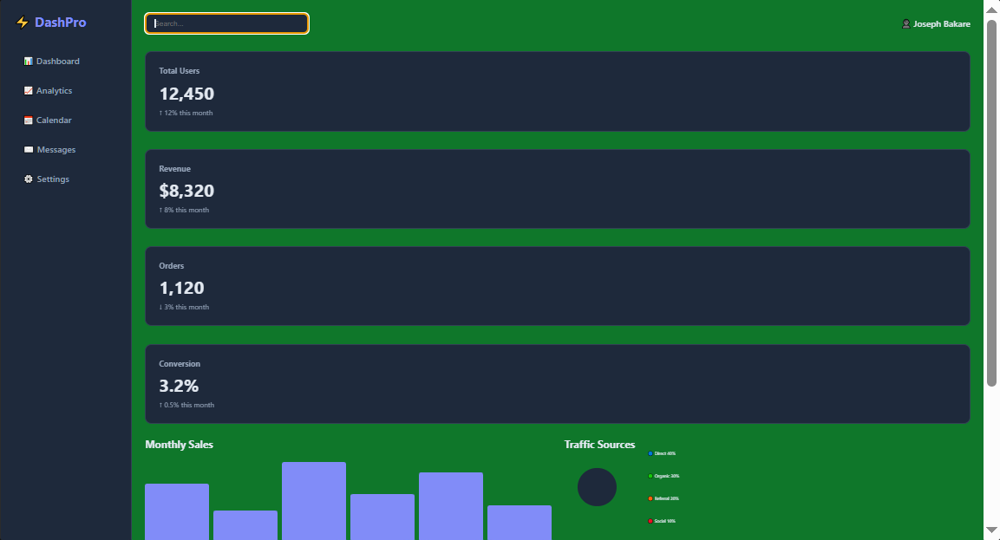
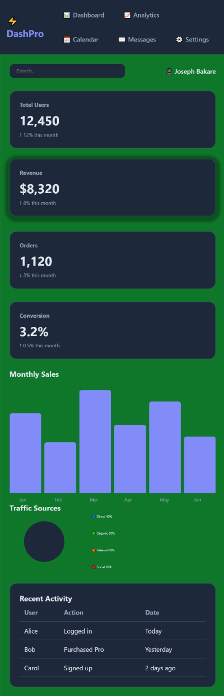

# Responsive Dashboard

> A modern analytics dashboard built with HTML and CSS.




> **BakeBeep UI Collection**

This project is part of the **BakeBeep UI Collection**—a growing library of modern, reusable interface components and frontend patterns designed with performance, accessibility, and maintainability in mind.

---

## Overview

Responsive Dashboard is a modern admin interface that demonstrates how analytics platforms can be structured using only HTML and CSS. It includes dashboard widgets, statistics cards, responsive navigation, data visualizations, and adaptive layouts that remain usable across different screen sizes.

The project focuses on information hierarchy, visual clarity, and reusable dashboard components commonly found in SaaS applications.

---

## Features

- Responsive sidebar navigation
- Statistics cards
- Analytics widgets
- Pure CSS bar chart
- Pure CSS donut chart
- Recent activity table
- Sticky navigation
- Automatic light/dark theme using `prefers-color-scheme`
- Responsive layout

---

## Demo

🌐 **Live Demo:** _Paste your Vercel deployment URL here_

### Animated Preview



### Desktop



### Mobile



---

## Design Philosophy

Dashboards should present large amounts of information without overwhelming users. This project emphasizes spacing, hierarchy, reusable widgets, and responsive layouts to create a clean administrative experience.

---

## Technologies

- HTML5
- CSS3
- CSS Grid
- Flexbox
- CSS Custom Properties
- Media Queries
- `prefers-color-scheme`
- Sticky Positioning
- `conic-gradient`

---

## Folder Structure

```text
responsive-dashboard/
│
├── assets/
├── css/
├── index.html
├── LICENSE
└── README.md
```

---

## Future Improvements

- Interactive charts
- Search functionality
- User profile menu
- Notification system
- Drag-and-drop widgets
- React implementation
- Tailwind CSS version
- Real API integration

---

## License

MIT License.

---

## About BakeBeep

BakeBeep is a software studio building modern web interfaces, reusable UI systems, and developer-focused digital products.

Every repository reflects our commitment to clean engineering, thoughtful design, accessibility, and continuous improvement.

Explore the BakeBeep UI Collection to discover more frontend projects.